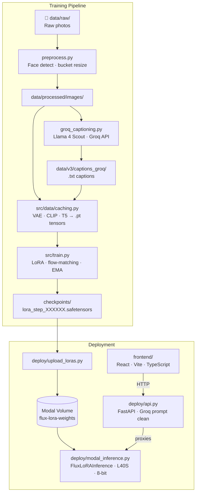

# LinkedIn LoRA

A personal fine-tuning project that trains a LoRA adapter on [FLUX.1-dev](https://huggingface.co/black-forest-labs/FLUX.1-dev) to generate professional LinkedIn-style portrait photos from text prompts. The full pipeline runs from raw photos on a laptop to a live serverless demo on Modal GPU infrastructure.

---

## Sample Outputs

| | | | |
|:---:|:---:|:---:|:---:|
|  |  |  |  |

*Generated with the trained LoRA at 768 × 768 px using FLUX.1-dev on an L40S.*

---

## Features

- **Custom LoRA from scratch** — hand-rolled `LoRALayer` wrapping `nn.Linear`, no PEFT dependency
- **Flow-matching training** — logit-normal timestep sampling and noise offset on FLUX.1-dev
- **LLM-powered captioning** — Groq (Llama 4 Scout) generates structured training captions with a trigger token
- **Latent caching** — VAE + CLIP + T5 encodings pre-computed once, training only touches the transformer
- **8-bit quantization** — `bitsandbytes` keeps the base transformer in memory during training and inference
- **EMA + gradient checkpointing** — optional exponential moving average and activation recomputation
- **Prompt cleaning** — Groq LLM rewrites casual user prompts into structured portrait prompts before generation
- **Parallel warm-up** — FastAPI backend fires Groq prompt-clean and Modal container warm-up simultaneously on every `/generate` request

---

## Architecture



---

## Pipeline

### 1. Preprocess images

Detects faces, crops to a head-and-shoulders frame, then resizes to the nearest aspect-ratio bucket for multi-resolution training.

```bash
python preprocess.py
# reads  data/raw/
# writes data/processed/images/
```

### 2. Caption images

Sends each image to Groq (Llama 4 Scout) with a detailed captioning prompt. Captions are saved as `.txt` files alongside the images.

```bash
python groq_captioning.py
# reads  data/v3/images/
# writes data/v3/captions_groq/
```

### 3. Train

Encodes the dataset to latent cache on the first run, then trains the LoRA adapter. Checkpoints and validation samples are saved to `checkpoints/`.

```bash
python -m src.train --config config/my_config.yaml
```

Trained on an **L40S GPU via [Lightning AI](https://lightning.ai) free credits** — completes in under 2.5 hours. Requires ~40 GB VRAM (the 8-bit base transformer alone peaks at ~24 GB; headroom is needed for the optimizer and activation cache).

### 4. Deploy inference to Modal

```bash
# Build the Modal image and bake FLUX.1-dev into it (~10-15 min first run)
modal deploy deploy/modal_inference.py

# Upload your trained checkpoints to the Modal Volume
python deploy/upload_loras.py
```

### 5. Deploy the API backend to Modal

```bash
modal deploy deploy/api.py
# Copy the printed URL into .env as modal_generate_url / modal_loras_url
```

### 6. Run the frontend

```bash
cd frontend
cp .env.example .env      # set VITE_API_URL=http://localhost:8000
npm install
npm run dev
```

Or run the API locally against the live Modal inference endpoint:

```bash
uvicorn deploy.api:fastapi_app --reload --port 8000
```

---

## Building Your Own Dataset

To train the LoRA on a different person, follow these steps before running the pipeline.

### 1. Collect photos

Drop 15–40 photos into `data/raw/`. More variety = better generalization:

- Mix of indoor, outdoor, and studio lighting
- Multiple angles: straight-on, slight left/right, slight up/down
- Neutral, smiling, and serious expressions
- Avoid heavy filters, sunglasses, or obscured faces
- At least a few full-head-and-shoulders frames (preprocess crops to this)

### 2. Choose a trigger token

Pick a unique string that won't appear naturally in prompts — a deliberate misspelling of the subject's name works well (e.g. `Shl0k` instead of `Shlok`). Open `groq_captioning.py` and set:

```python
Trigger_Prefix = "Portrait of YourToken,"
```

This token is embedded in every training caption so the model learns to associate it with the subject's appearance. Use the exact same token in inference prompts.

### 3. Preprocess

```bash
python preprocess.py
# reads  data/raw/
# writes data/processed/images/   (face-cropped, bucket-resized)
```

Images that don't contain a detectable face are skipped automatically.

### 4. Caption

```bash
python groq_captioning.py
# reads  data/processed/images/   (or data/v3/images/ — set image_dir in the script)
# writes data/v3/captions_groq/
```

Each caption is a structured description of clothing, pose, background, and lighting, prefixed with your trigger token. Review a few captions to make sure the trigger token appears correctly.

### 5. Update config

Point the training config at your new data:

```yaml
# config/my_config.yaml
data:
  images_dir:   "data/processed/images"
  captions_dir: "data/v3/captions_groq"
```

Then run training as normal (`python -m src.train --config config/my_config.yaml`).

---

## Configuration

All training hyperparameters live in `config/my_config.yaml`.

| Key | Default | Description |
|-----|---------|-------------|
| `model.name` | `black-forest-labs/FLUX.1-dev` | HuggingFace model ID |
| `model.quantize_base` | `true` | Load transformer in 8-bit (saves ~12 GB VRAM) |
| `lora.rank` | `16` | LoRA rank `r` |
| `lora.alpha` | `16` | LoRA scaling factor (scaling = alpha/r) |
| `lora.target_modules` | `to_q, to_k, to_v, to_out.0, proj_mlp, proj_out` | Linear layers to inject LoRA into |
| `train.steps` | `3000` | Total gradient steps |
| `train.lr` | `1e-4` | Peak learning rate |
| `train.warmup_steps` | `100` | Linear warmup steps |
| `train.optimizer` | `adamw8bit` | Optimizer (`adamw` or `adamw8bit`) |
| `train.ema.enabled` | `true` | Exponential moving average of weights |
| `train.ema.decay` | `0.99` | EMA decay rate |
| `save.save_every` | `250` | Save a checkpoint every N steps |
| `save.max_checkpoints` | `6` | Maximum checkpoints to keep on disk |
| `sample.sample_every` | `250` | Generate validation images every N steps |
| `data.caption_dropout` | `0.1` | Probability of dropping captions (CFG training) |

---

## Deployment Notes

The inference stack uses two Modal apps:

- **`flux-lora-inference`** — GPU class (`L40S`) that loads FLUX.1-dev once per container. Memory: ~24 GB peak (8-bit transformer + 8-bit T5 + bf16 CLIP/VAE).
- **`flux-lora-api`** — CPU-only FastAPI app that cleans prompts via Groq and proxies to the GPU class.

LoRA checkpoints (~15 MB each) live in a Modal Volume (`flux-lora-weights`) and are mounted into the inference container. The 35 GB base model is baked into the container image layer, so cold starts only need to load the model into GPU memory (~60 s) rather than downloading it.

---

## Tech Stack

| Layer | Technology |
|-------|-----------|
| Base model | FLUX.1-dev (Black Forest Labs) |
| Training | PyTorch 2.3+, custom LoRA, flow-matching |
| Quantization | bitsandbytes (8-bit) |
| Diffusers | HuggingFace `diffusers` + `transformers` |
| Captioning | Groq API — Llama 4 Scout 17B |
| Prompt cleaning | Groq API — Llama 3.3 70B |
| Inference backend | Modal (serverless GPU, L40S) |
| API | FastAPI + httpx |
| Frontend | React 19, Vite, TypeScript, Tailwind CSS, Framer Motion |
| Package manager | uv (Python), npm (frontend) |

---

## Frontend

The demo UI is a single-page React app built with Vite, TypeScript, and Tailwind CSS. It lets you type a casual prompt (e.g. "make me look like a CEO") and generate a portrait via the FastAPI backend. The UI was **designed and coded using Claude Sonnet 4.6**.

---

## Contact

**Shlok Parikh** — Student at [Indian Institute of Technology, Indore](https://www.iiti.ac.in/)

[](https://www.linkedin.com/in/shlok-parikh-370773335/)
[](mailto:parikh.shlokp@gmail.com)

---

## License

Apache 2.0 — see [LICENSE](LICENSE).
